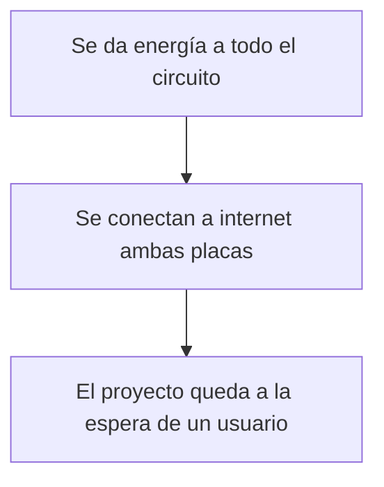

# ⋆⭒˚.⋆ └[∵┌] Examen "Grupo 02" - Acu-Visual [┐∵]┘ ⋆.˚⭒⋆

Lunes 22 de junio 2026

---

## Grupo 02. Pa-Pa's

### Integrantes

* [Camila Parada](https://github.com/Camila-Parada): Código, Investigación, Shopper
* [Vania Paredes](https://github.com/paredesvania): Touchdesigner, Código, Proyección, Registro.

## Descripción del proyecto

"¿Cómo presenciamos el "habitar" de los espacios a través del sonido presente en los edificios de la FAAD?"

Nos interesa observar en vivo las huellas sonoras (conversaciones, pasos, risas, silencios, etc) que dejan las personas al ocupar o transitar un lugar (espacio físico). Esta "identidad acústica" cambiante nos habla de cómo se vive y se comparte un espacio . Estos registros en tiempo real son la materia prima para la producción de visualizaciones experimentales producidas en Touchdesigner,

La dimensión material del proyecto abarca el uso de 2 placas rapsberry pi pico 2W, cada una con un "Sensor de Sonido (LM393)" que reúne información y la sube en 2 feeds en Adafruit IO. Cada uno de estos módulos se encuentran ubicados en uno de los edificios de la Facultad de Artes, Arquitectura y Diseño (República 180 y Salvador Sanfuentes 2221). 

Por otra parte, el computador (o el Arduino) recibirá dichos datos para posteriormente entregarlos a Touchdesigner. La visualización generativa en tiempo real posee variables como el movimiento, las formas y los colores que responden a la actividad sonora de cada lugar.

De esta manera, aquello que normalmente percibimos solo con el oído podrá manifestarse visualmente frente a nosotros.

Buscamos hacer visible una dimensión cotidiana que suele pasar desapercibida: la manera en que habitamos los espacios y cómo nuestra presencia los transforma a través de la relación entre sonido e imagen, la visualización funcionará como un retrato vivo de ambos lugares.

## Primeros acercamientos

En un inicio se utilizaron varias

## Input: Micrófono 

Para comenzar...

## Output: Touchdesigner

Al tener los datos recopilados ...

## Demostraciones en vivo

### Video en el mismo edificio (distintos espacios)

Video 1

### Video en distintos edificios

Video 2

## Bill of materials (listado de materiales)

| Componentes         | Tipo  | Cantidad | Precio  | Enlace            |
| ------------------- | ----- | -------- | ------- | ----------------  |
| Raspberry Pi Pico 2 W | Placa de desarrollo | 2   | $14.990 | <https://mcielectronics.cl/shop/product/74358//> |
| Mini Protoboard 400 Puntos | Placa prototipado | 2  | $1.500 | <https://afel.cl/products/mini-protoboard-400-puntos> |
| Cable Dupont Macho Macho 10cm | Cable | Pack 40 | $2.590 | <https://mcielectronics.cl/shop/product/cable-dupont-macho-macho-20cm-pack-40-unidades/> |
| Sensor Analógico Sonido/Audio MAX9812 | Sensor | 1 | $3.790 | <https://hubot.cl/producto/sensor-analogico-audio-max9812-sku-614/> |
| Pantalla LCD OLED 0,96 | Componente | 1 | $4.500 | <https://afel.cl/products/pantalla-lcd-oled-azul-y-amarillo-0-96> |

## Mapa de flujo

## Investigaciones individuales

Aportes, información y exploraciones personales compartidas con el equipo.

- [Camila Parada.md](./persona-01.md) 

- [Vania Paredes.md](./persona-02.md)

## Bibliografía

* <https://learn.adafruit.com/series/adafruit-io-basics>
