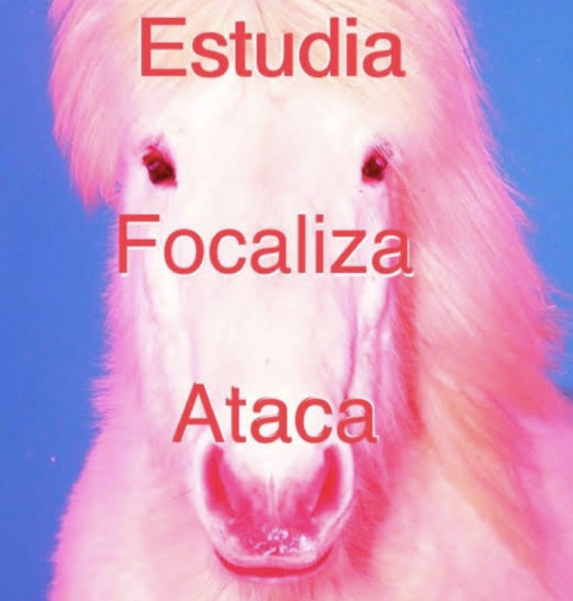

# sesion-14

lunes 15 junio 2026

## última antes de examen...

> la clase pasada fue de resolver dudas y probar los códigos para nuestro proyecto

**con este código quedamos la clase pasada**

```cpp
// -----------------------------
// SENSOR ULTRASÓNICO HC-SR04 + LED
// 3 condiciones + parpadeo + ausencia prolongada
// -----------------------------

const int trigPin = 2;
const int echoPin = 3;
const int ledPin = 6; // Pin PWM

long duracion;
float distancia;

String estadoActual = "";
String estadoAnterior = "";

// Control lectura sensor
unsigned long tiempoAnteriorSensor = 0;
const unsigned long intervaloSensor = 80;

// Control parpadeo LED
unsigned long tiempoAnteriorParpadeo = 0;
bool ledEncendido = false;

// Control ausencia prolongada
unsigned long tiempoInicioSinPresencia = 0;
bool contandoAusencia = false;
bool ausenciaProlongadaActivada = false;

const unsigned long tiempoAusencia = 120000;
// 120000 ms = 2 minutos

// Control encendido progresivo por ausencia
unsigned long tiempoAnteriorFade = 0;
const unsigned long intervaloFade = 200;
// Mientras más alto este número, más lento prende

int brilloAusencia = 0;

void setup() {
  Serial.begin(9600);

  pinMode(trigPin, OUTPUT);
  pinMode(echoPin, INPUT);
  pinMode(ledPin, OUTPUT);

  analogWrite(ledPin, 0);

  Serial.println("Sistema iniciado");
}

void loop() {
  unsigned long tiempoActual = millis();

  // -----------------------------
  // LECTURA DEL SENSOR
  // -----------------------------
  if (tiempoActual - tiempoAnteriorSensor >= intervaloSensor) {
    tiempoAnteriorSensor = tiempoActual;

    distancia = medirDistancia();

    if (distancia < 0) {
      estadoActual = "No se detecta lectura valida";
    }

    else if (distancia > 230) {
      estadoActual = "sin presencia";
    }

    else if (distancia > 150 && distancia <= 230) {
      estadoActual = "hay alguien lejano";
    }

    else if (distancia > 50 && distancia <= 150) {
      estadoActual = "alguien se acerca";
    }

    else if (distancia <= 50) {
      estadoActual = "hay alguien cerca";
    }

    if (estadoActual != estadoAnterior) {
      Serial.print("Distancia medida: ");
      Serial.print(distancia);
      Serial.println(" cm");

      Serial.print("Mensaje para Totem 02: ");
      Serial.println(estadoActual);

      Serial.println("-------------------------");

      estadoAnterior = estadoActual;
    }
  }

  // -----------------------------
  // DETECTAR SI HAY O NO PRESENCIA
  // -----------------------------

  bool sinPresencia = 
    estadoActual == "sin presencia" || 
    estadoActual == "No se detecta lectura valida";

  if (sinPresencia) {
    if (contandoAusencia == false) {
      tiempoInicioSinPresencia = tiempoActual;
      contandoAusencia = true;
      ausenciaProlongadaActivada = false;
      brilloAusencia = 0;
    }

    if (tiempoActual - tiempoInicioSinPresencia >= tiempoAusencia) {
      ausenciaProlongadaActivada = true;
    }
  }

  else {
    contandoAusencia = false;
    ausenciaProlongadaActivada = false;
    brilloAusencia = 0;
  }

  // -----------------------------
  // CONTROL DEL LED
  // -----------------------------

  if (sinPresencia) {
    if (ausenciaProlongadaActivada) {
      encenderProgresivamentePorAusencia();

      if (estadoActual != "ausencia prolongada") {
        estadoActual = "ausencia prolongada";

        Serial.println("Mensaje para Totem 02: ausencia prolongada");
        Serial.println("LED encendiendose lentamente por ausencia");
        Serial.println("-------------------------");
      }
    }

    else {
      analogWrite(ledPin, 0);
      ledEncendido = false;
    }
  }

  else if (estadoActual == "hay alguien lejano") {
    parpadearLED(1000, 80);
    // parpadeo lento
  }

  else if (estadoActual == "alguien se acerca") {
    parpadearLED(400, 150);
    // parpadeo medio
  }

  else if (estadoActual == "hay alguien cerca") {
    analogWrite(ledPin, 255);
    // encendido fijo al máximo
    ledEncendido = true;
  }
}

// -----------------------------
// FUNCIÓN PARA MEDIR DISTANCIA
// -----------------------------
float medirDistancia() {
  digitalWrite(trigPin, LOW);
  delayMicroseconds(2);

  digitalWrite(trigPin, HIGH);
  delayMicroseconds(10);
  digitalWrite(trigPin, LOW);

  duracion = pulseIn(echoPin, HIGH, 25000);

  if (duracion == 0) {
    return -1;
  }

  float distanciaCalculada = duracion * 0.0343 / 2;

  return distanciaCalculada;
}

// -----------------------------
// FUNCIÓN PARA PARPADEAR LED
// -----------------------------
void parpadearLED(unsigned long intervalo, int brillo) {
  unsigned long tiempoActual = millis();

  if (tiempoActual - tiempoAnteriorParpadeo >= intervalo) {
    tiempoAnteriorParpadeo = tiempoActual;

    ledEncendido = !ledEncendido;

    if (ledEncendido) {
      analogWrite(ledPin, brillo);
    } else {
      analogWrite(ledPin, 0);
    }
  }
}

// -----------------------------
// FUNCIÓN PARA AUSENCIA PROLONGADA
// -----------------------------
void encenderProgresivamentePorAusencia() {
  unsigned long tiempoActual = millis();

  if (tiempoActual - tiempoAnteriorFade >= intervaloFade) {
    tiempoAnteriorFade = tiempoActual;

    if (brilloAusencia < 255) {
      brilloAusencia++;
    }

    analogWrite(ledPin, brilloAusencia);
  }
}
```

## cosas

en la clase pasada quedamos con que teniamos que corregir algunas cosas, mejorar la forma en que se envían los datos a Adafruit IO. actualmente, el código trabaja con los valores que entrega directamente el sensor ultrasónico, es decir, enviando constantemente las mediciones de distancia. sin embargo, para evitar enviar una gran cantidad de información innecesaria, la idea es simplificar esos datos y traducirlos a estados específicos. en lugar de enviar cada medición realizada por el sensor, se podrían enviar únicamente códigos asociados a determinadas condiciones. por ejemplo, un valor para indicar ausencia de personas, otro para una presencia lejana, otro para una presencia cercana y otro para una presencia reconocida. de esta manera, la comunicación sería más simple y fácil de interpretar por el segundo tótem.

> a y tambien agregar demo con un boton por si nos falla el sensor.

# durante la semana

con amistad es amigo trabajamos durante la semana resolviendo la corrección anterior. nos dedicamos a generar los códigos nuevos y los de demo con botón. 

trabajamos en el código del primer tótem, que detecta cuando una persona se acerca mediante un sensor ultrasónico. como el sensor enviaba demasiados datos, simplificamos la información y la convertimos en códigos antes de enviarla.

quedó así:

* 0: sin presencia
* 1: distancia 01
* 2: distancia 02
* 3: distancia 03
* 4: ausencia prolongada

también ajustamos los rangos de distancia para que funcionaran mejor con el prototipo y agregamos un promedio entre varias mediciones para evitar cambios bruscos o errores en la detección. sdemás, incorporamos un pequeño tiempo de espera para confirmar cada estado antes de cambiarlo.

**demo con botón** 

también agregamos un botón para poder demostrar el funcionamiento del sistema durante la presentación, sin depender de que alguien estuviera frente al sensor. el botón permite recorrer manualmente los distintos estados del tótem:

* 1° presión: distancia 01
* 2° presión: distancia 02
* 3° presión: distancia 03
* 4° presión: ausencia prolongada
* 5° presión: vuelve al modo sensor

esto nos permitió probar y mostrar el proyecto de forma más simple y controlada. yeiii 



> portada de mi playlist que nos dio animo para trabajar

