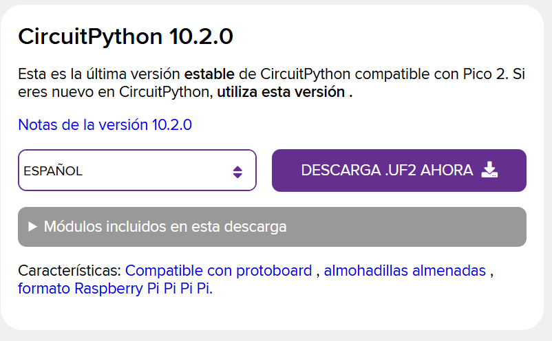

# sesion-08

lunes 27 abril 2026

# Trabajo en clases: Python en Raspberry Pi

## Introducción

Durante esta clase trabajamos con **Python** en una **Raspberry Pi Pico**, utilizando recursos descargados y distintas herramientas necesarias para comenzar a programar dispositivos electrónicos mediante CircuitPython.

---

## ¿Qué es Python?

Python es un lenguaje de programación fácil de escribir y entender. Se caracteriza por:

- Sintaxis simple utilizando indentación con espacios.
- Menor cantidad de código en comparación con otros lenguajes.
- Gran cantidad de bibliotecas y herramientas disponibles.
- Facilidad para trabajar con proyectos electrónicos y automatización.

---

## ¿Qué es CircuitPython?

Usamos **CircuitPython**, una adaptación de Python diseñada especialmente para microcontroladores, permitiendo programar dispositivos electrónicos de manera más simple y rápida.

CircuitPython facilita el trabajo con sensores, actuadores y distintos componentes conectados a la Raspberry Pi Pico.



---

## Instalación de CircuitPython

Durante la clase realizamos la instalación de **CircuitPython 10.2.0**.

Pasos realizados:

- Borrar la información previa almacenada en la Raspberry Pi Pico.
- Instalar la nueva versión de CircuitPython.
- Copiar los archivos correspondientes al sistema.
- Verificar el correcto funcionamiento del dispositivo.

---

## Uso inicial

Una vez instalado el sistema:

- Abrimos la aplicación correspondiente.
- Exploramos el entorno de programación.
- Probamos la conexión entre el computador y la Raspberry Pi Pico.
- Reiniciamos el dispositivo utilizando:

```python
Ctrl + D
